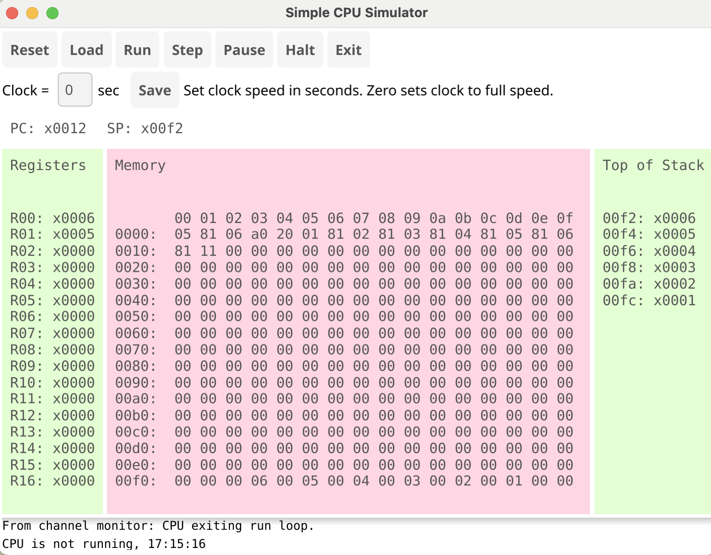

# Introduction

This CPU simulator is a re-implementation in Go of my (Wojciech S. Gac) solution to a programming contest held at my workplace recently. It's also the result of my growing interest in trying to understand low-level details of how processors carry out computation. The architecture of this particular processor is very simplistic, allowing easy understanding of its internals, at the cost of making actual programming cumbersome and tedious.

**Chris Riddick has added a GUI front-end to the simulator. The GUI is based on the Fyne.io API library that supports Mac, Windows, and Linux.**

## Architecture description

The CPU has 17 registers, special register `R0`, which serves as an accumulator, among other things, and 16 general purpose registers, referred to as `R1`-`R16` in this document. Programs are sequences of 8-bit bytes, each byte encoding a single instruction, together with its arguments. The CPU also has a stack of size 1000. It is assumed that after completion the results of a program are stored in `R0`.

## Instructions

In the description below the following symbolic bits are used:
`V` - value (bits encoding literal value)
`R` - register (registers are encoded according to the pattern: `0` - `R1`, `1` - `R2`, etc.)
`X` - ignored
`S` - switch bit (switches between two modes of an instruction)
`L` - label (used to define targets for GOTO jumps)

Note: The label `L` is not a normal machine code usage. In this context, it provides a simple means for using GOTO
instructions without having to reference a memory address. A proper assembler would translate a label in the assembly
code to a memory address to which a JUMP instruction would move the Program Counter (PC). A future enhancement to this
simulator will remove the need for the preprocessor and `LABEL` instruction.

The table below describes the complete instruction set, together with bit patterns:

Instruction|Bit Pattern|Description
----------|----|-----
SET|000VVVVV|Set R0 to VVVVV
ADD|001RRRRX|R0 += RRRR
SUB|010RRRRX|R0 -= RRRR
MUL|011RRRRX|R0 *= RRRR
PUSH|100RRRRS|if (S==1) {PUSH(R0)} else {PUSH(RRRR)}
POP|101RRRRS|if (S==1) {POP(R0)} else {POP(RRRR)}
GOTO|110LLLLS|if (S==1) {if (R0!=0) {GOTO LLLL}} else {IF (R0==0) {GOTO LLLL}}
LABEL|111LLLLX|Mark next instruction with label LLLL

## Assembler

The code also contains a simple mnemonic translator (the function `AsmCodeToBytes`), which allows one to write programs using mnemonics instead of bare hex numbers. Below is a sample mnemonic definition of a program summing numbers from 1 to 10:

```go
sum1To10 := []string{
    "set_0",
    "push_0",
    "pop_1",
    "set_10",
    "push_0",
    "pop_2",
    "set_1",
    "push_0",
    "pop_3",
    "label_0",
    "push_1",
    "pop_0",
    "add_2",
    "push_0",
    "pop_1",
    "push_2",
    "pop_0",
    "sub_3",
    "push_0",
    "pop_2",
    "goto_0_1",
    "push_1",
    "pop_0",
}
```
## GUI Dashboard

The basic CPU simulator devloped by Wojciech S. Gac ran only in a terminal. I selected this code because it was a good starting point around which I can learn Go and Fyne and build a functional GUI to run the simulator. My interests include learning Go and Fyne, but also in building useful CPU simulators to be used to learn how a CPU functions internally.

I want to be able to watch the changing registers and memory as the CPU executes each instruction. To do that, I need a comprehensive dashboard to control the CPU and display the results. While implementing the GUI, I added buttons to trigger the running of a program. There are buttons to step through a program as well as pausing and restarting it. I wanted to learn how to use Go structures and related methods to implement simple object-oriented features. The CPU becomes an OO structure with related methods. Likewise, the dashboard is another OO structure that supports methods for updating elements of the UI.

During the implementation of the UI, I realized that once a CPU entered the instruction execution loop, that function never returned until the program finished. So, even if I have a button to pause execution, the program doesn't see it until the Run() function returns. I learned about Go routines and channels to enable concurrent execution. This allows the Run() function to get a message from the dashboard that the pause button was pressed.

This re-architecting of the simulator now supports the introduction of more complex CPU designs. The present implentation has only eight instructions and does not have a NOP or HALT instruction. Running a program requires the simulator to know how long the program is in order to stop before running on indefinitely or generation a segmentation fault. Also, the simple CPU mixes bytes and ints, whereas a true CPU works on byte and words. A word is defined to be a specific number of bits, usually 16, 32, or 64. I changed the GUI display to show everything in hexadecimal rather than integers to better show what is happening inside the simulator. Also, I copy the program into memory space and run from there as a real CPU would do. The stack should also be placed in memory, and that will be a future update.

Here is a sample of what you will see on the dashboard

